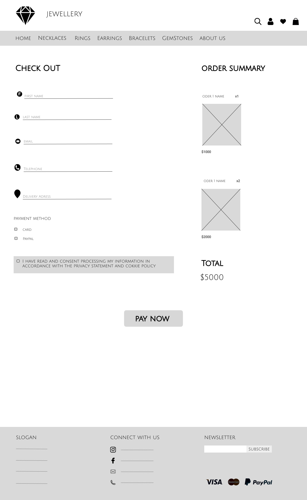
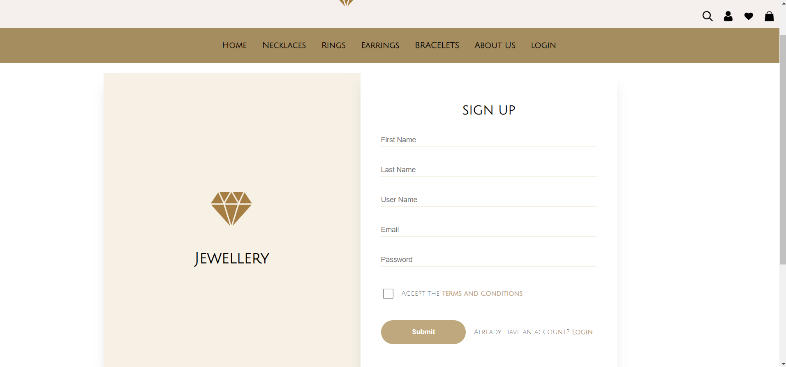

<h1 align="center">E-commerce Jewellery Website</h1>
<h3 align="center">An e-commerce jewellery website where customers can browse and purchase a variety of jewellery items. The website typically displays products in categories such as necklaces, bracelets, earrings and rings. The website usually features high-quality product images and detailed descriptions, as well as customer reviews.</h3>
<h3 align="left">Languages and Tools:</h3>

      

- 👨‍💻 Authors: Sana Al Rayess, Hassan Bachir

- 📫 How to reach out to Sana Al Rayess **rayess.sana@gmail.com**

- 📫 How to reach out to Hassan Bachir **hassan.bachir001@gmail.com**

- 🌱 Date: 06-March-2023

- 📝 References used in the project:

- <ul><li><a href="https://youtu.be/mxHoPYFsTuk">Web Dev Simplified</a>
  </li>
  <li><a href="https://youtu.be/Iy7oFI76FpE" >Abdelrahman Gamal</a></li>
  <li><a href="https://youtu.be/JttTcnidSdQ">Traversy Media</a></li>
  </ul> 

<h1 align="left">User Stories</h1>
<ul><li>As a registered user, I want to be able to login to the website with my email address and password so that I can access my account and make purchases.</li>
<li>As an unregistered user, I want to be able to create a new account on the website with my email address, password, name, and shipping/billing address so that I can make purchases and have them delivered to me.</li>
<li>As a user, I want to be able to reset my password if I forget it by providing my email address and following a password reset process so that I can access my account and make purchases.</li>
<li>As a user, I want to be able to view a list of available products  so that I can find what i am looking for.</li>
<li>As a user, I want to be able to add products to my wish list for future reference so that I can easily find find them later.</li>
<li>As a user, I want to be able to remove products from my cart or change the quantity of products in my cart so that I can adjust my purchase as needed.</li>
<li>As a user, I want to be able to view detailed information about a specific product, including its name, description, price, and images so that I can make an informed decision about purchasing the product.</li>
<li>As a user, I want to be able to view the products in my cart, their quantities, and their total price so that I can confirm my purchase before checkout.</li>
<li>As a user, I want to be able to review my order and make any final changes before submitting it so that I can ensure that my order is correct.
</li>
<li>As a user, I want to be able to edit my account information such as my name, email, and shipping/billing address so that my orders are delivered correctly.</li>
<li>As an admin, I want to be able to add/edit/remove products to the website, including their name, description, price, and quantity so that website stays up to date.
</li>
<li>As an admin, I want to be able to view a list of registered users on the website and their associated information, so that I can monitor the website's user base.</li>  

<h1 align="left">Color Palette:</h1> 
  

<h1 align="left">Wireframes:</h1> 

| main page | Earings | chekkout |
| --- | --- | --- |
|  |  |  |

| login | sign up | admin page |
| --- | --- | --- |
|  |  |  |

| Edit profile | necklaces | rings |
| --- | --- | --- |
|  |  |  |

 
<h1 align="left">Implimentation:</h1> 

| Main page | Main page | Main page |
| --- | --- | --- |
|  |  |  |

| necklaces | sigup | login |
| --- | --- | --- |
|  |  |  |

| cart | admin panel | Earings |
| --- | --- | --- |
|  |  |  |

 <h1 align="left">Prerequisites:</h1> 
<ul>
<li>A computer with an internet connection</li>
<li>A web browser</li>
<li>Git installed on your computer</li>
<li>A code editor such as Visual Studio Code</li>
<li>A local web server like Apache installed on your computer</li>
<li>A database management system like MySQL</li>

 <h1 align="left">Steps:</h1>
<ul>
<li>Clone the ecommerce project repository from GitHub onto your local computer using Git command: git clone https://github.com/ecommerce_project.git</li>
<li>Navigate to the project directory using the terminal or command prompt.</li>
<li>Open the project in your code editor.</li>
<li>Now you can run the project</li>
